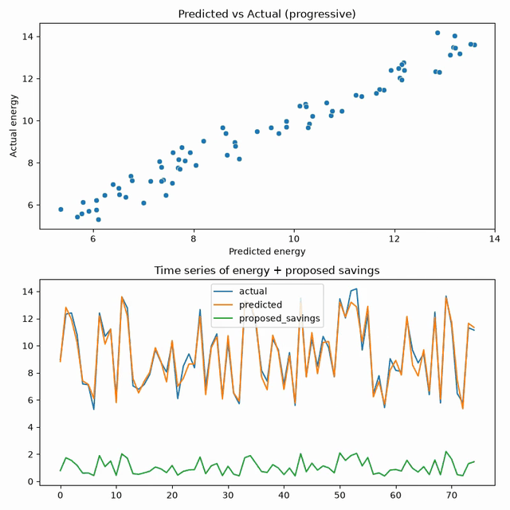

# AI Energy Optimization for Radio Base Stations — Prototype

Explainable energy-optimization prototype for Radio Base Stations (RBS).

Overview

This is a compact, runnable proof-of-concept that demonstrates how lightweight, explainable AI models can recommend energy-efficiency actions for Radio Base Stations (RBS) without sacrificing basic Quality of Service (QoS). The implementation uses synthetic data so you can present a full end-to-end workflow (data → model → recommendations → demo) even without operator telemetry.

Why this project

- End-to-end prototype: data generation → training → evaluation → recommendations → demo video.
- Easy to adapt: replace the synthetic data generator with your own telemetry loader when you have access to real RAN data.
- Demo included: a short MP4 (`demo/demo.mp4`) shows predicted vs actual energy and proposed power-reduction actions.

What’s included

- `src/data_loader.py` — synthetic dataset generator (traffic, active cells, temperature, QoS proxies, energy).
- `src/model.py` — training and model persistence helpers (Random Forest regressor).
- `src/train.py` — CLI to train and save a model to `models/model.joblib`.
- `src/evaluate.py` — evaluate a saved model on held-out synthetic data.
- `src/energy_optimizer.py` — simple heuristic that proposes power reductions based on QoS headroom.
- `demo/run_demo.py` — generates `demo/demo.mp4` visualizing predictions and proposed savings.
- `Dockerfile`, `docker-compose.yml` — optional containerized training.

Quickstart (local)

1. Create a virtual environment and install dependencies:

```bash
python -m venv .venv
source .venv/bin/activate
pip install -r requirements.txt
```

2. Train a model (creates `models/model.joblib`):

```bash
python -m src.train --output models/model.joblib
```

3. Evaluate the model:

```bash
python -m src.evaluate --model models/model.joblib
```

4. Generate the demo video (creates `demo/demo.mp4`):

```bash
python demo/run_demo.py
```

Notes about artifacts and Git

I included the trained model and demo video in the repository so the project looks polished and runnable when reviewed. If you prefer a repo without large binaries, remove `models/model.joblib` and `demo/demo.mp4` before pushing, or store them in a release or object store and link from the README.

Next steps I can take for you

- Initialize a local Git repo and make a clean initial commit including the model and demo (I can do this now). 
- Or create a lightweight commit that excludes large artifacts and instead provides instructions to generate them locally.

If you want me to commit everything locally now, tell me whether you want the demo video and model included in the commit. If yes, I will initialize Git and create the commit.

Live demo

Below is the demo video generated by the repository. If you are viewing this on GitHub the player should appear below — or you can open the file directly at `demo/demo.mp4`.

<div align="center">
</div>

<!-- GIF preview embedded so the demo appears inline on GitHub -->
<div align="center">
	
</div>

<div align="center">
	<video controls width="720" src="https://raw.githubusercontent.com/AbhilashChinnamsetti/rbs-energy-optimizer/main/demo/demo.mp4">Your browser does not support the video tag.</video>
</div>

If the video does not render in the README, you can download or open it directly here: [demo/demo.mp4](demo/demo.mp4)

